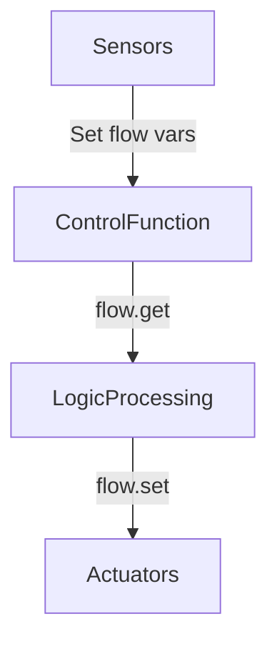

# HVAC-SMART-CONTROL

### 空调智能控制系统 (VRV-P/氟系统通用)  
**Node-RED Function Node**  
*版本 v4.1 | 大金VRV-P兼容 | 理论上支持所有氟系统空调*

---

### 项目简介  
这是一个全功能的空调控制系统，专为Node-RED设计，通过Function节点实现对大金VRV-P空调（及其他氟系统空调）的智能控制。系统通过流变量(flow variables)传递数据，包含温度补偿、风速优化、PTC电辅热、喷水降温等高级功能，适用于多区域家庭环境。

```markdown
### 🚀 核心功能
- **智能温控**：动态温度补偿 + 多区域加权平均算法
- **能效优化**：自动风速控制 + 喷水器散热 + 设备房风扇联动
- **特殊模式**：  
  - PTC电辅热（寒冷天气辅助制热）  
  - 新风系统智能切换（旁通/热交换模式）
- **安全机制**：降频检测 + 防频繁启停保护
```

---

### 📥 输入变量 (需预先设置)  
| 变量名                    | 数据类型 | 描述                          | 示例                     |
|---------------------------|----------|-------------------------------|--------------------------|
| `{room_id}_panel_mode`    | string   | 面板模式 (`heat/cool/off`等)  | `bedroom1_panel_mode`    |
| `{room_id}_room_temp`     | number   | 房间温度 (℃)                  | `bedroom1_room_temp=24.5`|
| `{room_id}_return_temp`   | number   | 空调回风温度 (℃)              | `bedroom1_return_temp`   |
| `{room_id}_target_temp`   | number   | 用户设定温度 (℃)              | `bedroom1_target_temp=22`|
| `outdoor_fin_temp`        | number   | 外机翅片温度 (℃)              | `outdoor_fin_temp=42.3`  |
| `system_power`            | number   | 系统实时功率 (W)              | `system_power=1200`      |
| `device_room_temp`        | number   | 设备房温度 (℃)                | `device_room_temp=32.1`  |
| `ventilation_status`      | string   | 新风状态 (`on/off`)           | `ventilation_status="on"`|

> **区域ID列表**: `bedroom1`, `livingroom`, `kitchen` 等 (详见代码`INDOOR_UNITS`配置)

---

### 📤 输出变量 (控制指令)  
| 变量名                  | 数据类型 | 描述                          |
|-------------------------|----------|-------------------------------|
| `{room_id}_adjusted_temp` | number   | 补偿后的设定温度              |
| `{room_id}_sync_mode`     | string   | 同步后的空调模式              |
| `fan_speed_set`           | number   | 设备房风扇转速 (0-255)        |
| `water_spray_set`         | boolean  | 喷水器开关状态                |
| `ventilation_mode_set`    | string   | 新风模式 (`bypass`/`heat`)    |
| `derating_flag`           | boolean  | 系统是否降频                  |

---

### ⚙️ 配置指南  
1. **基础设置** (`SYSTEM`对象):  
   - `execution_period_ms`: 执行周期 (默认15000ms=15秒)  
   - `features`: 启用/禁用功能模块 (如喷水器/新风控制)  

2. **区域配置** (`INDOOR_UNITS`对象):  
   ```javascript
   "bedroom1": {
     capacity: 1.8,           // 匹数
     has_external_panel: true, // 是否有外置面板
     ptc_enabled: true        // 是否支持PTC电辅热
   }
   ```

3. **特殊功能调参**:  
   - 喷水器: `WATER_SPRAY.trigger_temp` (默认43℃触发)  
   - PTC电辅热: `PTC.min_temp` (默认5℃以下启用)  
   - 风速控制: `FAN_SPEED.auto_control` (温差风速映射表)

---

### 🛠 使用步骤  
1. **导入代码**  
   - 创建Node-RED Function节点，粘贴完整代码  
   - 确保所有依赖变量已通过其他节点注入流上下文(flow context)

2. **数据流架构**:  
   ```mermaid
   graph LR
   A[传感器节点] --> B(设置flow变量)
   B --> C[本控制函数]
   C --> D(读取flow变量)
   D --> E[执行器节点]
   ```

3. **调试模式**:  
   在代码顶部启用调试输出：  
   ```javascript
   debug: {
     enabled: true,  // 启用调试
     level: 2        // 详细程度 (1-3)
   }
   ```

---

### ⚠️ 注意事项  
1. **执行周期**  
   - 需严格匹配`SYSTEM.execution_period_ms`与实际调度间隔  
   - 推荐使用`inject`节点定时触发 (15秒间隔)

2. **温度精度**  
   - 所有温度变量需保留1位小数 (通过`safeToFixed()`处理)

3. **初次使用**  
   - 先禁用高级功能 (`features.xxx = false`)  
   - 逐步启用模块并观察日志  

4. **空调兼容性**  
   - 默认支持大金VRV-P协议  
   - 其他品牌需验证MQTT/Modbus数据点映射

---

### Air Conditioning Intelligent Control System  
**For Daikin VRV-P / Universal Fluorine Systems**  

> *Complete documentation available in Chinese section. Key features:*  
> - **Multi-zone weighting algorithm**  
> - **Adaptive fan control**  
> - **PTC auxiliary heating**  
> - **Water spray cooling**  
> - **Ventilation mode auto-switching**  

**Usage Flow**:  


**Debug Tips**:  
```javascript
// Enable detailed logging:
debug: { 
  enabled: true,
  ptc_debug: true // PTC-specific logs
}
```
